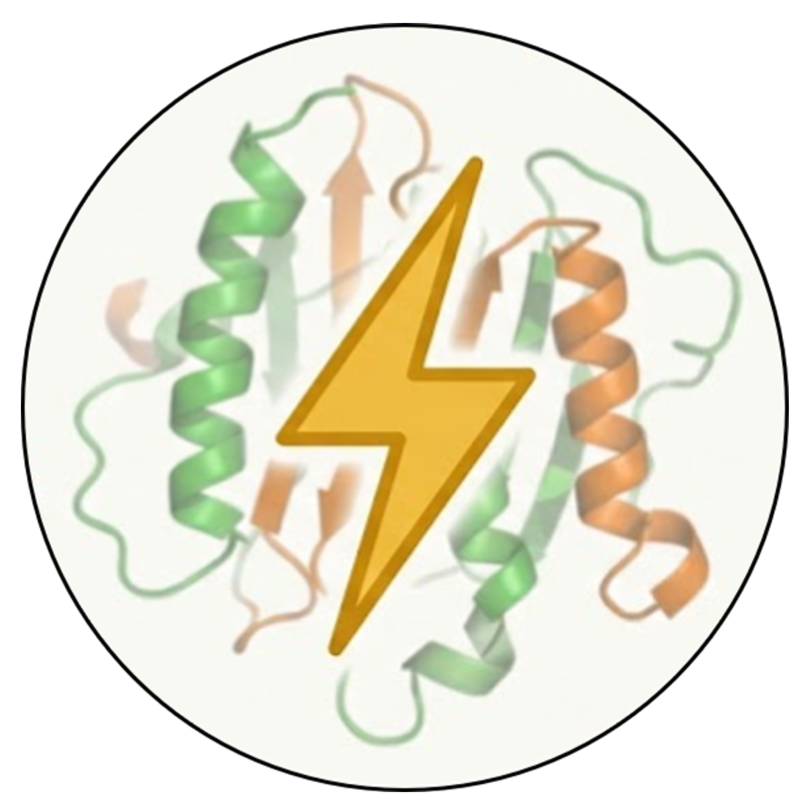

# SPARK ⚡

**Structure Parser, Alignment, and Reformatting Kit**

**SPARK** is a lightweight Python toolkit bridging classic PDB with modern AI models. Seamlessly convert mmCIF & JSON formats to PDB, parse complex coordinate data, and run high-precision structural alignments to compare and evaluate multiple models of the same protein.

Whether you are standardizing raw prediction outputs from deep learning models (like AlphaFold, OpenFold2, or Boltz-1/2), benchmarking algorithms, or visualizing atomic nuances, SPARK provides a unified pipeline.

### 🌐 Try the Live Web App!

SPARK is also available as a fully interactive, ready-to-use Streamlit web application: **https://deepbiswas-spark.hf.space/**

> 💡 **Quick Tips for the Web App:**
> * **Is the app sleeping?** Free Streamlit servers occasionally pause inactive apps. If you see a "sleeping" or "down" page, simply click the **Wake Up** button and give it a minute or two to boot back up.
> * **Dark vs. Light Theme:** The tool supports both dark and light UI themes! Make sure to use the **"Viewer Background"** toggle in the sidebar to match your system theme so the 3D molecular structures contrast perfectly.
> 
> 

---

## ✨ Key Features

* 🔄 **Universal Format Conversion:** Extract structural strings from complex JSON envelopes and convert them directly to standard `.pdb` formats. Handles raw PDB strings and parses embedded `mmCIF` data.
* 📐 **Structural Alignment & Metrics:** Dynamically compare multiple models of the same protein against a reference structure. Automatically calculates:
* Root-Mean-Square Deviation (RMSD)
* Radius of Gyration (Rg)
* Average B-Factor (Model Confidence)
* Atom, Residue, and HETATM counts


* 📊 **Automated Reporting:** Compiles all structural metrics into a clean, easy-to-read Pandas DataFrame for side-by-side model evaluation.
* 🔬 **Interactive 3D Visualization:** Features an embedded 4-panel `py3Dmol` viewer to visualize and compare proteins, isolating specific elements like Water (HOH) and Hydrogens across different chains.

## 🚀 Quick Start & Usage

The core functionality of SPARK is provided in the included Jupyter Notebook pipeline. Here are the main workflows:

### 1. Converting AI Models (JSON) to PDB

Extract structures generated by modern folding algorithms (e.g., Boltz-2) that hide `mmCIF` data inside a JSON wrapper:

```python
from bio import PDB
# (Refer to the SPARK notebook for the full function)

convert_specific_boltz_json("prediction_model.json", "output_clean.pdb")

```

### 2. Generating the Ultimate Comparison Table

Evaluate a folder full of different structural models for the same protein:

```python
# Analyzes multiple .pdb files and generates a DataFrame with RMSD, Rg, etc.
df_results = generate_ultimate_table("path/to/pdb/directory", reference_pdb="target.pdb")
print(df_results)

```

### 3. Interactive Visualization

Run the visualization block in the notebook to launch a synchronized 4-panel interactive grid comparing structural elements:

* **Panel 1:** Clean Protein
* **Panel 2:** Protein + Water Molecules
* **Panel 3:** Protein + Hydrogen Atoms
* **Panel 4:** Full Complex

## 📁 Repository Structure

* `SPARK_–_Structure_Parser,_Alignment,_and_Reformatting_Kit.ipynb`: The main pipeline notebook containing all functions for conversion, analysis, and visualization.
* `data/` *(Recommend creating this)*: Folder to place your input `.json`, `.cif`, and `.pdb` files.

👨‍💻 Developer & Contributor

Dr. Deeptarup Biswas - [LinkedIn Profile](https://www.linkedin.com/in/deeptarup-biswas-039825178/)

## 📜 License

This project is licensed under the MIT License - see the LICENSE file for details.
